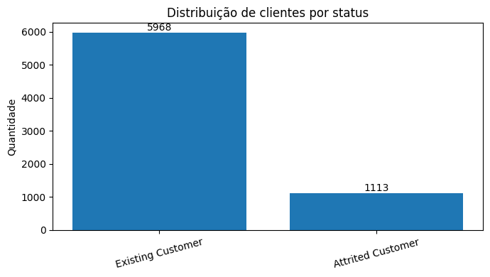
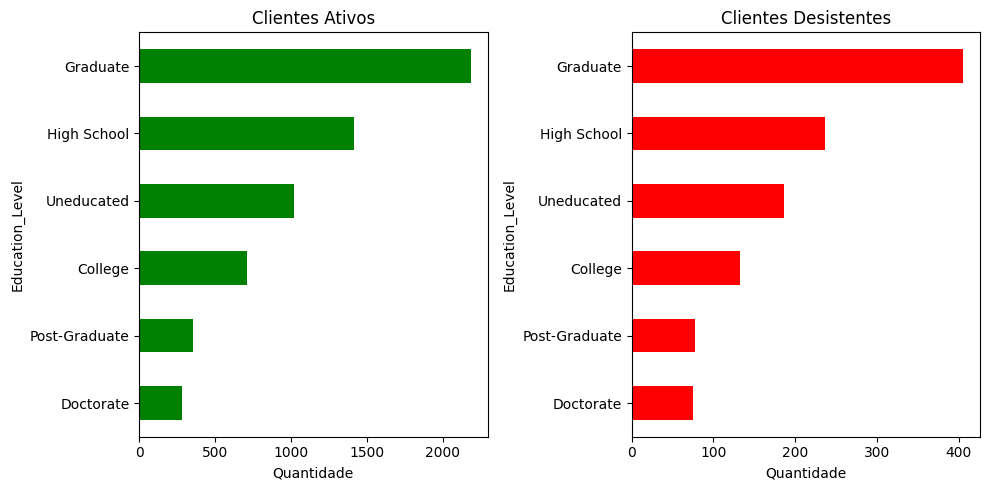
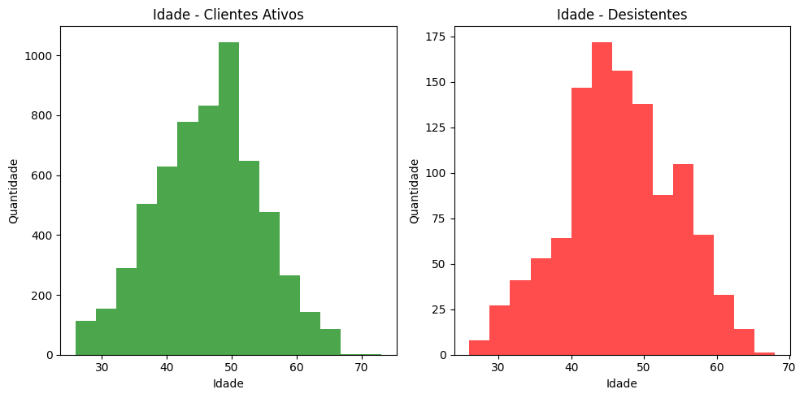
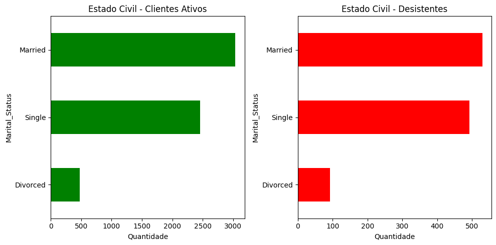
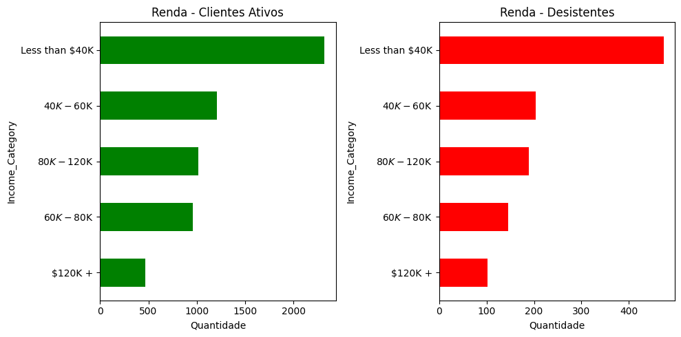
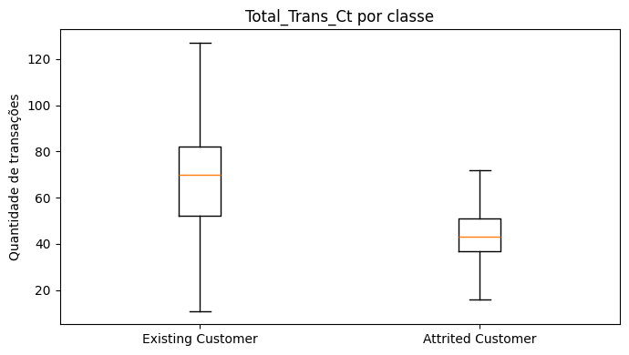
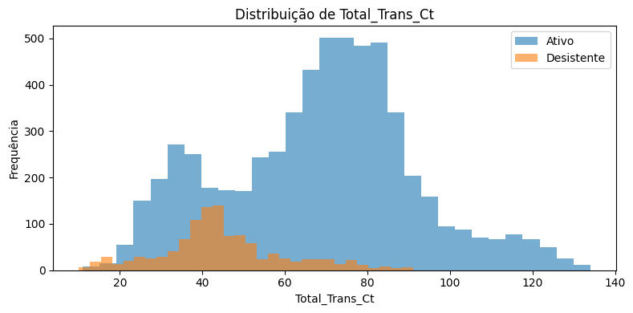
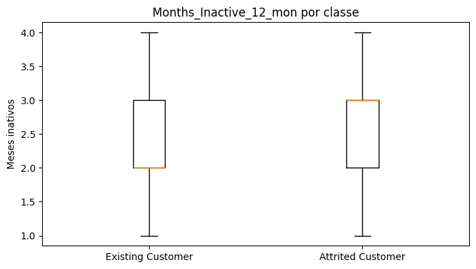
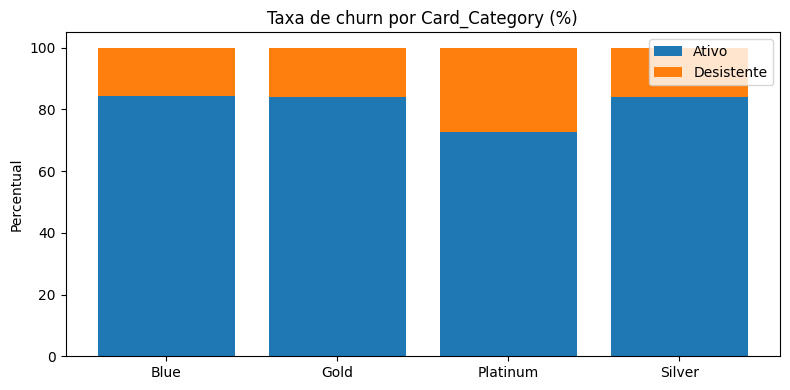

# Conhecendo os dados

Nesta seção, deverá ser registrada uma detalhada análise descritiva e exploratória sobre a base de dados selecionada na Etapa 1 com o objetivo de compreender a estrutura dos dados, detectar eventuais _outliers_ e também, avaliar/detectar as relações existentes entre as variáveis analisadas.
Para isso, sugere-se que sejam utilizados cálculos de medidas de tendência central, como média, mediana e moda, para entender a centralidade dos dados; sejam exploradas medidas de dispersão como desvio padrão e intervalos interquartil para avaliar a variabilidade dos dados; sejam utilizados gráficos descritivos como histogramas e box plots, para representar visualmente as características essenciais dos dados, pois essas visualizações podem facilitar a identificação de padrões e anomalias; sejam analisadas as relações entre as variáveis por meio de análise de correlação, gráficos de dispersões, mapas de calor, entre outras técnicas.
Inclua nesta seção, gráficos, tabelas, trechos de código e demais artefatos que você considere relevantes para entender os dados com os quais você irá trabalhar. Além disso, inclua e comente os trechos de código mais relevantes desenvolvidos para realizar suas análises. Na pasta "src", inclua o código fonte completo.

## Descrição dos achados

### Visão geral do dataset

O dataset utilizado — *BankChurners.csv* — contém originalmente 10.127 registros e 23 colunas, abrangendo informações demográficas, financeiras e comportamentais de clientes de cartão de crédito. Após a etapa de limpeza, foram removidos registros com valores "Unknown" nas colunas `Education_Level`, `Marital_Status` e `Income_Category`, pois esses valores ausentes poderiam prejudicar a qualidade do treinamento do modelo. A coluna identificadora `CLIENTNUM` também foi excluída por não contribuir para a análise. Após essas etapas, o dataset ficou com **7.081 registros e 22 colunas**, sem linhas duplicadas.

```python
# Limpeza dos dados
df_dataset = df_dataset[df_dataset != "Unknown"].dropna()
df_dataset.drop(columns=['CLIENTNUM'], inplace=True)
```

### Estatística descritiva

A tabela abaixo resume as principais métricas das variáveis numéricas mais relevantes para a análise:

| Variável | Média | Desvio Padrão | Mínimo | Mediana (50%) | Máximo |
|---|---|---|---|---|---|
| `Customer_Age` | 46,35 | 8,04 | 26 | 46 | 73 |
| `Total_Trans_Ct` | 64,50 | 23,81 | 10 | 67 | 134 |
| `Months_Inactive_12_mon` | — | — | — | 2–3* | — |
| `Credit_Limit` | 8.492,77 | 9.126,07 | 1.438,30 | 4.287,00 | 34.516,00 |
| `Total_Trans_Amt` | 4.394,30 | 3.468,46 | 510 | 3.831 | 17.995 |

*Mediana de 2 meses para clientes ativos e 3 meses para desistentes — detalhado na seção de variáveis comportamentais.*

### Desbalanceamento de classes

A variável-alvo `Attrition_Flag` apresenta um claro desbalanceamento: dos 7.081 registros, **5.968 (84,3%) correspondem a clientes ativos** (*Existing Customer*) e **1.113 (15,7%) a clientes desistentes** (*Attrited Customer*). Esse desbalanceamento é um ponto de atenção importante para a etapa de modelagem, pois pode enviesar algoritmos de classificação em favor da classe majoritária, demandando técnicas como oversampling, undersampling ou pesos de classe.



### Análise de outliers

A detecção de outliers foi realizada com base na regra do Intervalo Interquartil (IQR), identificando valores abaixo de `Q1 − 1,5×IQR` ou acima de `Q3 + 1,5×IQR`. A tabela abaixo apresenta a contagem por variável:

| Variável | Outliers detectados |
|---|---|
| `Credit_Limit` | 715 |
| `Avg_Open_To_Buy` | 710 |
| `Total_Trans_Amt` | 624 |
| `Contacts_Count_12_mon` | 449 |
| `Months_Inactive_12_mon` | 223 |

A decisão foi **manter os outliers** em todas as variáveis para esta etapa. Para `Credit_Limit`, `Avg_Open_To_Buy` e `Total_Trans_Amt`, os valores extremos refletem perfis reais de clientes com alto limite ou alto volume de compras, e sua remoção implicaria perda de informação relevante. Para `Contacts_Count_12_mon` e `Months_Inactive_12_mon`, os valores atípicos podem representar comportamentos preditivos de churn e serão reavaliados na fase de modelagem, onde técnicas como *capping* ou transformações logarítmicas poderão ser aplicadas caso impactem negativamente a performance do modelo.

### Perfil demográfico e sua relação com o churn

**Nível educacional:** A distribuição por escolaridade é bastante similar entre os dois grupos. As categorias *Graduate* e *High School* concentram o maior volume em ambas as classes — *Graduate* representa 36,5% dos desistentes e 36,6% dos ativos, e *High School* representa 21,3% e 23,7%, respectivamente. Essa proximidade nas proporções indica que o nível de educação, isoladamente, não é um fator diferenciador expressivo para o cancelamento.



**Faixa etária:** A inspeção visual dos histogramas não revelou separação expressiva entre as distribuições de idade dos dois grupos. A mediana de idade é de **46 anos em ambos os grupos**, com distribuições concentradas entre 40 e 55 anos. Com base nessa análise descritiva, a idade não se destaca como variável diferenciadora — seu poder preditivo será avaliado na etapa de modelagem.



**Estado civil:** Casados e solteiros dominam ambos os grupos de forma proporcional. Assim como na escolaridade, o estado civil não revelou um padrão diferenciador relevante entre as classes.



**Faixa de renda:** A categoria *Less than $40K* é a mais frequente nos dois grupos, representando 42,5% dos desistentes e 38,9% dos ativos. As demais faixas também se distribuem de forma próxima entre os grupos, sem diferença expressiva que qualifique a renda declarada como preditor isolado de cancelamento.



### Variáveis comportamentais — principais diferenciadores

As variáveis que mais revelaram diferenças entre os grupos foram aquelas relacionadas ao **comportamento transacional** dos clientes:

**Volume de transações (`Total_Trans_Ct`):** O boxplot e o histograma mostram uma separação clara entre os grupos. Clientes ativos apresentam mediana de **70 transações**, enquanto os desistentes registram mediana de **43 transações** — uma diferença de 27 transações na mediana. No histograma, observa-se que a distribuição dos desistentes concentra-se em faixas mais baixas, enquanto os ativos se distribuem por faixas mais altas. Isso sugere que a **queda no uso do cartão é um dos sinais mais fortes de propensão ao cancelamento**.





**Inatividade nos últimos 12 meses (`Months_Inactive_12_mon`):** O boxplot revela que clientes desistentes tendem a apresentar mais meses de inatividade do que os ativos. A mediana de meses inativos dos clientes desistentes é de **3 meses**, contra **2 meses** dos clientes ativos. Descritivamente, observa-se que períodos mais longos sem uso do cartão estão associados a uma maior proporção de clientes que cancelaram o serviço.



### Taxa de churn por categoria de cartão

A análise da taxa de cancelamento por tipo de cartão, calculada como proporção dentro de cada categoria, apresentou os seguintes resultados:

| Categoria | Ativos (%) | Desistentes (%) |
|---|---|---|
| Blue | 84,3% | 15,7% |
| Silver | 83,9% | 16,1% |
| Gold | 84,0% | 16,0% |
| Platinum | 72,7% | 27,3% |

As categorias *Blue*, *Silver* e *Gold* apresentam taxas de churn muito próximas, entre 15,7% e 16,1%. O cartão *Platinum* apresenta uma taxa de 27,3%, descritivamente superior às demais, porém essa categoria concentra pouquíssimos clientes na base, o que limita qualquer interpretação mais ampla. De forma geral, a categoria do cartão não apresenta diferença expressiva nas proporções de churn entre os grupos analisados.



### Síntese dos achados

Em resumo, os achados mais relevantes da análise exploratória são:

- O dataset é **desbalanceado**, com 84,3% de clientes ativos e 15,7% de desistentes, o que demandará técnicas de balanceamento na fase de modelagem.
- **Variáveis demográficas** (idade, escolaridade, estado civil e renda) apresentaram distribuições proporcionalmente similares entre os dois grupos, sem diferenças marcantes que as qualifiquem como preditores isolados de churn.
- As **variáveis comportamentais** se mostraram as mais discriminativas: clientes desistentes apresentam mediana de **43 transações** contra **70 dos clientes ativos**, e mediana de **3 meses de inatividade** contra **2 meses**, configurando os sinais mais claros de propensão ao cancelamento.
- A **categoria do cartão** apresentou taxas de churn descritivamente similares entre *Blue* (15,7%), *Silver* (16,1%) e *Gold* (16,0%). O *Platinum* registrou 27,3%, mas com volume de clientes muito reduzido na base.
- Os **outliers** foram mantidos intencionalmente, pois podem representar comportamentos reais e preditivos de clientes, sendo sua reavaliação prevista para a etapa de modelagem.

Esses achados reforçam a importância de monitorar o **engajamento transacional** dos clientes como estratégia de prevenção ao cancelamento.

## Ferramentas utilizadas

O projeto foi desenvolvido inteiramente em **Python**, utilizando o ambiente **Google Colab** para execução e prototipação do código. As principais bibliotecas empregadas foram:

- **Pandas** — manipulação, limpeza e transformação dos dados tabulares. Utilizada para leitura do CSV, remoção de registros inconsistentes, agrupamentos e cálculo de estatísticas descritivas (`describe()`, `value_counts()`, `crosstab()`).
- **Matplotlib** — criação dos gráficos estáticos. Foi a biblioteca principal para a geração de histogramas, boxplots e gráficos de barras que comparam os grupos de clientes ativos e desistentes.
- **Seaborn** — complemento ao Matplotlib para visualizações estatísticas com estilização aprimorada.
- **NumPy** — suporte a operações numéricas e vetorizadas utilizadas internamente pelas demais bibliotecas.
- **KaggleHub** — download automatizado do dataset diretamente da plataforma Kaggle, garantindo reprodutibilidade na coleta dos dados.
