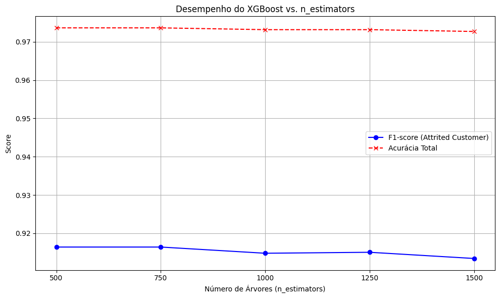
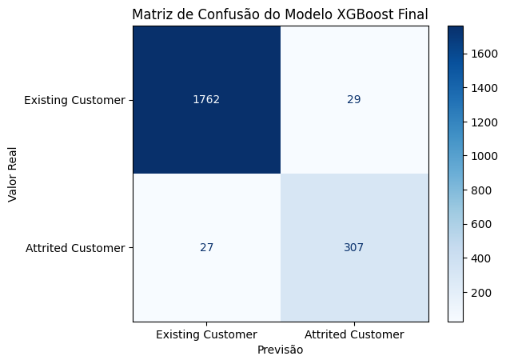

# Preparação dos dados

Nesta etapa são descritas todas as técnicas utilizadas para o pré-processamento e tratamento dos dados, com base nas características do dataset *BankChurners.csv* e no objetivo de construir um modelo de previsão de churn.

## Remoção de colunas irrelevantes e com data leakage

Antes da limpeza, foram removidas duas colunas que comprometeriam a qualidade do modelo:

- **`CLIENTNUM`**: identificador único do cliente, sem valor preditivo.
- **Colunas Naive Bayes** (`Naive_Bayes_Classifier_Attrition_Flag_*`): geradas a partir da variável-alvo, causariam vazamento de informação (*data leakage*) durante o treinamento.

## Limpeza de dados

Registros com o valor `"Unknown"` nas colunas `Education_Level`, `Marital_Status` e `Income_Category` foram removidos, pois a imputação de categorias desconhecidas poderia introduzir ruído no modelo. Após essa limpeza, o dataset passou de 10.127 para **7.081 registros**, sem linhas duplicadas.

```python
df_dataset = df_dataset[df_dataset != "Unknown"].dropna()
df_dataset.drop(columns=['CLIENTNUM'], inplace=True)
print(f"Número de registros: {df_dataset.shape[0]}")
print(f"Número de colunas: {df_dataset.shape[1]}")
print(f"Número de linhas duplicadas: {df_dataset.duplicated().sum()}")
```

## Tratamento de outliers

A detecção de outliers foi realizada com base na regra do Intervalo Interquartil (IQR). A decisão foi **manter os outliers** em todas as variáveis, pois eles representam comportamentos reais de clientes (altos limites de crédito, alto volume de transações, longos períodos de inatividade) que podem ser preditivos de churn. Sua reavaliação está prevista para etapas futuras de otimização do modelo, onde técnicas como *capping* ou transformações logarítmicas poderão ser aplicadas.

## Codificação de variáveis categóricas (One-Hot Encoding)

As variáveis categóricas (`Gender`, `Education_Level`, `Marital_Status`, `Income_Category`, `Card_Category`) foram convertidas para formato numérico utilizando `pd.get_dummies()` com `drop_first=True`, que elimina a primeira categoria de cada variável para evitar multicolinearidade.

```python
X_xgb = pd.get_dummies(X_xgb, drop_first=True)
```

## Criação da variável-alvo

A variável-alvo `is_desistente` foi criada a partir de `Attrition_Flag`, mapeando `"Attrited Customer"` para `1` e `"Existing Customer"` para `0`.

```python
df_dataset["is_desistente"] = (df_dataset["Attrition_Flag"] == "Attrited Customer").astype(int)
```

## Tratamento do desbalanceamento de classes

O dataset apresenta desbalanceamento: 84,3% de clientes ativos (5.968) contra 15,7% de desistentes (1.113). Para lidar com isso sem técnicas de reamostragem, utilizou-se o parâmetro `scale_pos_weight` do XGBoost, calculado como a razão entre o número de amostras da classe negativa e da classe positiva. Isso instrui o modelo a penalizar mais os erros na classe minoritária durante o treinamento.

```python
scale_pos_weight_val = sum(y_train_xgb == 0) / sum(y_train_xgb == 1)
```

## Separação em treino e teste

Os dados foram divididos em 70% para treino e 30% para teste, com `stratify=y_xgb` para garantir que a proporção das classes fosse mantida em ambos os conjuntos, e `random_state=42` para reprodutibilidade.

```python
X_train_xgb, X_test_xgb, y_train_xgb, y_test_xgb = train_test_split(
    X_xgb, y_xgb, test_size=0.3, random_state=42, stratify=y_xgb
)
```

---

# Descrição do modelo

O algoritmo selecionado para a construção do modelo de previsão de churn foi o **XGBoost (Extreme Gradient Boosting)**.

## Princípios de funcionamento

O XGBoost é uma implementação otimizada de árvores de decisão em *gradient boosting*. Ele constrói um modelo aditivo de forma sequencial, onde cada nova árvore tenta corrigir os erros das árvores anteriores. Os conceitos fundamentais incluem:

- **Ensemble Learning**: combina as previsões de múltiplas árvores de decisão para produzir uma previsão final mais robusta.
- **Gradient Boosting**: utiliza otimização de gradiente para minimizar a função de perda a cada iteração.
- **Regularização (L1 e L2)**: controla a complexidade do modelo e previne overfitting.
- **Processamento Paralelo**: permite treinamento eficiente mesmo em grandes volumes de dados.
- **Feature Importance**: fornece um ranking da importância de cada variável, auxiliando na interpretabilidade.

## Vantagens e limitações

**Vantagens:**
- Alta performance em problemas de classificação tabular.
- Suporte nativo ao parâmetro `scale_pos_weight` para datasets desbalanceados.
- Capacidade de lidar com valores ausentes de forma intrínseca.
- Fornecimento de importância de features para interpretabilidade.

**Limitações:**
- Custo computacional elevado com número alto de árvores e dados de alta dimensionalidade.
- Interpretabilidade mais complexa em comparação com modelos mais simples, apesar do recurso de feature importance.

## Justificativa da escolha

A escolha do XGBoost foi embasada em sua comprovada eficácia em problemas de previsão de churn em contextos financeiros e bancários, conforme demonstrado nos estudos de Al-Najjar et al. (2022) e Li e Yan (2025). Sua capacidade de lidar nativamente com desbalanceamento de classes via `scale_pos_weight` e sua eficiência computacional o tornam adequado ao contexto deste projeto.

## Ajuste do hiperparâmetro `n_estimators`

Foram realizados testes sistemáticos com os valores `[500, 750, 1000, 1250, 1500]` para o parâmetro `n_estimators`, que controla o número de árvores no modelo. A métrica principal de avaliação foi o **F1-score da classe `Attrited Customer`**, por ser mais adequada para datasets desbalanceados.

```python
n_estimators_values = [500, 750, 1000, 1250, 1500]

for n_est in n_estimators_values:
    xgb_model = xgb.XGBClassifier(
        objective='binary:logistic',
        eval_metric='logloss',
        n_estimators=n_est,
        random_state=42,
        use_label_encoder=False,
        scale_pos_weight=scale_pos_weight_val
    )
    xgb_model.fit(X_train_xgb, y_train_xgb)
    y_pred_xgb = xgb_model.predict(X_test_xgb)
    f1 = f1_score(y_test_xgb, y_pred_xgb, pos_label=1)
```

Os resultados indicaram que `n_estimators=500` e `n_estimators=750` atingiram o pico de desempenho com **F1-score de 0.9164**. A partir de 500 árvores, os ganhos foram marginais ou inexistentes, enquanto o custo computacional continuava aumentando. Por isso, `n_estimators=500` foi selecionado para o modelo final, oferecendo o melhor equilíbrio entre performance preditiva e eficiência computacional.



---

# Avaliação do modelo criado

## Métricas utilizadas

Para avaliar o desempenho do modelo foram utilizadas as seguintes métricas, todas calculadas sobre o conjunto de teste:

- **F1-score**: métrica principal, escolhida por ser a média harmônica entre precisão e recall, equilibrando as duas medidas. Em datasets desbalanceados, é mais representativa que a acurácia isolada, pois avalia o desempenho especificamente na classe minoritária (`Attrited Customer`).
- **Acurácia (Accuracy)**: proporção de previsões corretas sobre o total. Útil como visão geral, mas potencialmente enganosa em cenários desbalanceados.
- **Precisão (Precision)**: de todos os clientes previstos como desistentes, quantos realmente cancelaram. Reflete o custo de ações de retenção desnecessárias (Falsos Positivos).
- **Recall (Sensibilidade)**: de todos os clientes que realmente cancelaram, quantos o modelo identificou. Reflete o custo de não identificar um cliente em risco (Falsos Negativos) — o erro mais custoso no contexto de churn.

## Discussão dos resultados obtidos

O modelo XGBoost final, treinado com `n_estimators=500` e `scale_pos_weight` calculado a partir do conjunto de treino, obteve os seguintes resultados no conjunto de teste:

| Métrica | Valor |
|---|---|
| Acurácia Geral | 0.9736 |
| F1-score (Attrited Customer) | 0.9164 |
| Precisão (Attrited Customer) | 0.9137 |
| Recall (Attrited Customer) | 0.9192 |

O F1-score de **0.9164** para a classe minoritária demonstra que o modelo é eficaz em identificar clientes propensos ao cancelamento, mantendo bom equilíbrio entre precisão e recall. A precisão de **0.9137** indica que, quando o modelo sinaliza um cancelamento, está correto em mais de 91% das vezes, minimizando o esforço em ações de retenção desnecessárias. O recall de **0.9192** é particularmente relevante: significa que o modelo identifica mais de 91% dos clientes que realmente irão cancelar, permitindo intervenções antecipadas.

### Matriz de Confusão



| | Previsto: Ativo | Previsto: Desistente |
|---|---|---|
| **Real: Ativo** | 1762 (TN) | 29 (FP) |
| **Real: Desistente** | 27 (FN) | 307 (TP) |

- **Verdadeiro Negativo (TN) — 1762**: clientes ativos corretamente identificados como ativos.
- **Falso Positivo (FP) — 29**: clientes ativos sinalizados erroneamente como desistentes. Em termos de negócio, representam esforços de retenção aplicados a clientes que não cancelariam.
- **Falso Negativo (FN) — 27**: clientes desistentes não identificados pelo modelo. Este é o erro mais custoso no contexto de churn, pois representa clientes que cancelaram sem que houvesse oportunidade de intervenção.
- **Verdadeiro Positivo (TP) — 307**: clientes desistentes corretamente identificados, permitindo ações de retenção direcionadas.

A baixa quantidade de Falsos Negativos (27) é o resultado mais relevante: o modelo deixa passar menos de 9% dos clientes que realmente cancelarão, o que representa uma capacidade sólida de detecção antecipada de churn.

---

# Pipeline de pesquisa e análise de dados

O pipeline seguiu um conjunto organizado e replicável de processos, desde a coleta dos dados até a avaliação final do modelo:

1. **Coleta dos dados**: dataset *BankChurners.csv* baixado do Kaggle via `kagglehub`, garantindo reprodutibilidade na coleta.
2. **Análise exploratória (EDA)**: compreensão da estrutura, estatísticas descritivas numéricas e categóricas, visualização de distribuições e análise de outliers via IQR.
3. **Remoção de colunas**: exclusão de `CLIENTNUM` (identificador sem valor preditivo) e das colunas Naive Bayes (causariam *data leakage*).
4. **Limpeza dos dados**: remoção de registros com valores `"Unknown"`, verificação de nulos e duplicatas.
5. **Análise de outliers**: identificação via regra do IQR nas variáveis financeiras e comportamentais, com decisão de manutenção justificada.
6. **Preparação para modelagem**: criação da variável-alvo `is_desistente`, codificação One-Hot das variáveis categóricas e divisão estratificada em treino (70%) e teste (30%).
7. **Tratamento do desbalanceamento**: uso de `scale_pos_weight` para penalizar erros na classe minoritária durante o treinamento.
8. **Teste de hiperparâmetros**: avaliação sistemática de `n_estimators` em `[500, 750, 1000, 1250, 1500]` com F1-score como métrica guia.
9. **Treinamento do modelo final**: XGBoost com `n_estimators=500`, escolhido pelo melhor equilíbrio entre desempenho e eficiência computacional.
10. **Avaliação final**: análise detalhada via acurácia, F1-score, precisão, recall e Matriz de Confusão no conjunto de teste.
