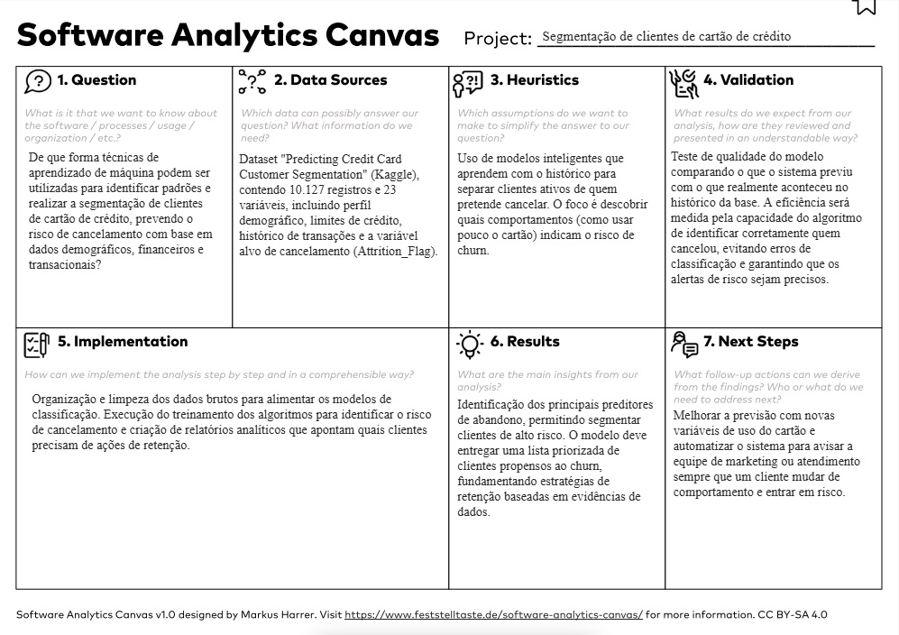

# Introdução

O avanço das tecnologias de análise de dados e da Inteligência Artificial (IA) tem transformado a forma como as organizações analisam informações e conduzem seus processos de decisão. A IA pode ser compreendida como um conjunto de sistemas capazes de processar grandes volumes de dados, identificar padrões, estabelecer correlações e apoiar a tomada de decisão em diferentes contextos organizacionais (YU et al., 2024). Nesse sentido, seu uso ultrapassa a automação de tarefas, passando a ocupar papel estratégico no apoio a decisões em níveis operacionais, táticos e estratégicos.

Esse movimento é particularmente relevante em setores intensivos em informação, como o financeiro, no qual a velocidade das transações, a diversidade de perfis de clientes e a complexidade dos comportamentos de consumo exigem métodos analíticos cada vez mais robustos. Estudos recentes apontam que a IA vem sendo aplicada de forma crescente em operações, marketing, finanças e gestão estratégica, tanto como ferramenta de suporte à decisão quanto como mecanismo automatizado de análise e resposta (YU et al., 2024). No setor bancário, por sua vez, a aplicação de técnicas de aprendizado de máquina e redes neurais tem se destacado na identificação de padrões suspeitos, na análise de transações em tempo real e na prevenção de fraudes financeiras, evidenciando o potencial da IA para ampliar a segurança e a eficiência das operações (TOSTA; DIAS, 2025).

A literatura mostra, portanto, que a utilização de IA no setor financeiro não se limita à detecção de irregularidades. As mesmas bases conceituais que sustentam sistemas de prevenção a fraudes também podem ser adaptadas para compreender padrões de comportamento, segmentar perfis de clientes e gerar subsídios para estratégias de relacionamento e retenção. Em outras palavras, se a IA é capaz de reconhecer anomalias em transações bancárias, ela também pode ser aplicada para identificar regularidades, perfis de uso e características comportamentais em bases de clientes, contribuindo para análises mais refinadas e para a geração de conhecimento estratégico.

Diante desse cenário, este projeto propõe investigar como técnicas de aprendizado de máquina podem ser utilizadas para identificar padrões em dados de clientes de cartão de crédito, contribuindo para a segmentação de perfis de usuários e para a compreensão do comportamento de consumo no setor financeiro. A proposta está alinhada tanto com a literatura sobre o uso organizacional da IA na tomada de decisão (YU et al., 2024) quanto com estudos que evidenciam a eficácia de métodos baseados em IA para análise de grandes volumes de dados financeiros (TOSTA; DIAS, 2025).

## Problema

Instituições financeiras enfrentam o desafio constante de compreender o comportamento de seus clientes e identificar sinais que indiquem mudanças no relacionamento com seus serviços. No caso específico de clientes de cartão de crédito, fatores como redução na frequência de uso, alterações no padrão de consumo, variações no limite utilizado e mudanças no perfil financeiro podem indicar risco de cancelamento, queda no engajamento ou transformação no perfil de relacionamento com a instituição.

A dificuldade em identificar esses padrões de forma antecipada pode resultar em perda de clientes, diminuição de receitas e aumento de custos associados à aquisição de novos usuários. Além disso, o crescimento das transações digitais e o aumento da complexidade das operações financeiras ampliam a necessidade de métodos automatizados capazes de analisar grandes volumes de dados e reconhecer comportamentos relevantes em tempo hábil. Segundo Tosta e Dias (2025), a IA tem sido aplicada com sucesso no contexto bancário justamente por sua capacidade de identificar padrões suspeitos e processar dados em larga escala, o que demonstra seu potencial para apoiar análises financeiras mais complexas.

Sob outra perspectiva, Yu et al. (2024) destacam que a IA tem sido progressivamente incorporada aos processos decisórios organizacionais como instrumento de apoio à análise, à classificação e à recomendação. Isso indica que técnicas de aprendizado de máquina podem ser empregadas não apenas para detectar eventos anômalos, mas também para compreender regularidades, relações entre variáveis e agrupamentos de perfis em bases de clientes. Dessa forma, torna-se relevante investigar métodos que permitam identificar características comuns entre clientes de cartão de crédito e compreender melhor os diferentes perfis existentes na base analisada.

Assim, o problema central deste estudo consiste em entender como técnicas de aprendizado de máquina podem ser utilizadas para identificar padrões comportamentais e segmentar clientes de cartão de crédito com base em atributos demográficos, financeiros e de relacionamento, gerando informações úteis para análises estratégicas no setor financeiro.

## Questão de pesquisa

De que forma técnicas de aprendizado de máquina podem ser utilizadas para identificar padrões e realizar a segmentação de clientes de cartão de crédito com base em características demográficas, financeiras e comportamentais presentes no conjunto de dados analisado?

## Objetivos preliminares

Explorar e aplicar modelos de aprendizado de máquina para identificar padrões e segmentar clientes de cartão de crédito com base nas características presentes no conjunto de dados selecionado.

### Objetivos específicos

- Realizar uma análise exploratória do conjunto de dados, identificando características, padrões e possíveis inconsistências nos dados disponíveis.
- Investigar diferentes abordagens de aprendizado de máquina que possam ser aplicadas para segmentação ou classificação de clientes com base em seus atributos.
- Comparar o desempenho de diferentes técnicas de modelagem para compreender quais abordagens apresentam melhores resultados no contexto do problema analisado.
- Relacionar os resultados obtidos à literatura sobre uso da IA em processos decisórios organizacionais e em análises no setor financeiro.
- Avaliar de que forma os padrões identificados podem contribuir para a compreensão do comportamento de clientes e para a geração de insights estratégicos.

## Justificativa

A análise do comportamento de clientes no setor financeiro é um tema de elevada relevância, uma vez que a retenção, o engajamento e o relacionamento com o cliente exercem impacto direto sobre a sustentabilidade e a competitividade das instituições financeiras. Estratégias de segmentação e análise comportamental tornam-se, nesse contexto, fundamentais para compreender perfis de usuários, apoiar decisões de marketing, orientar ações de relacionamento e subsidiar o desenvolvimento de produtos e serviços.

Com o crescimento do volume de dados disponíveis nas organizações, técnicas de ciência de dados e aprendizado de máquina passaram a ocupar papel central na transformação desses dados em conhecimento útil para a tomada de decisão. Yu et al. (2024) demonstram que a IA vem sendo utilizada em diferentes áreas funcionais das organizações, com destaque para operações e marketing, sobretudo como mecanismo de suporte a decisões em ambientes complexos e intensivos em dados. Esse panorama reforça a importância de estudar aplicações concretas da IA em cenários organizacionais e setoriais específicos.

No setor bancário e financeiro, esse avanço ganha ainda mais relevância diante da necessidade de processar grandes quantidades de informações em tempo real e identificar padrões que nem sempre são perceptíveis por métodos tradicionais. Tosta e Dias (2025) evidenciam que técnicas de IA, especialmente aprendizado de máquina e redes neurais, vêm sendo utilizadas para detectar padrões suspeitos e prevenir fraudes em transações bancárias. Embora o foco do referido estudo esteja na segurança financeira, sua contribuição teórica é importante para este projeto, pois demonstra como a IA pode extrair valor analítico de dados transacionais complexos. Essa mesma lógica pode ser aplicada à identificação de perfis de clientes, deslocando o foco da detecção de anomalias para a compreensão de padrões de comportamento.

O conjunto de dados selecionado para este projeto reúne informações sobre clientes de cartão de crédito, incluindo variáveis demográficas, limites de crédito, histórico de transações e indicadores de relacionamento com a instituição. Tais atributos oferecem condições adequadas para explorar técnicas de análise exploratória, segmentação e modelagem, permitindo investigar como diferentes variáveis se associam e contribuem para a formação de perfis distintos de clientes.

Além disso, esta pesquisa apresenta relevância acadêmica e prática. Do ponto de vista acadêmico, contribui para o debate sobre aplicações de IA e aprendizado de máquina em problemas de negócio, especialmente no contexto de Sistemas de Informação e Ciência de Dados. Do ponto de vista prático, pode gerar insights úteis para o setor financeiro, auxiliando na compreensão do comportamento dos clientes e no desenvolvimento de estratégias orientadas por dados. Dessa forma, o estudo se justifica por articular fundamentos teóricos recentes com uma aplicação analítica concreta em um problema real e atual.

## Público-alvo

Os resultados deste estudo podem beneficiar diferentes perfis de profissionais e áreas de atuação relacionadas ao setor financeiro e à análise de dados.

Entre os principais grupos beneficiados, destacam-se:

- **Analistas de dados e cientistas de dados**, interessados em compreender como técnicas de aprendizado de máquina podem ser aplicadas à análise de comportamento de clientes.
- **Profissionais do setor financeiro**, especialmente aqueles envolvidos com relacionamento com clientes, marketing, prevenção de perdas e gestão de produtos financeiros.
- **Gestores e tomadores de decisão**, que podem utilizar os insights derivados da análise de dados para apoiar estratégias de retenção, segmentação e personalização de serviços.
- **Pesquisadores e estudantes** das áreas de Sistemas de Informação, Ciência de Dados, Administração e Finanças, que buscam compreender aplicações práticas da IA em problemas reais de negócio.

# Estado da Arte

A literatura recente tem demonstrado que a Inteligência Artificial vem sendo incorporada de forma progressiva aos processos de decisão organizacional e às análises de dados no setor financeiro. Em linhas gerais, os estudos convergem ao indicar que a IA amplia a capacidade de tratar grandes volumes de dados, identificar padrões complexos e apoiar decisões em cenários marcados por elevada complexidade informacional. Entretanto, a forma como essas aplicações se materializam varia de acordo com o problema investigado, o tipo de dado disponível, os algoritmos utilizados e os objetivos analíticos de cada pesquisa.

No plano organizacional mais amplo, Yu et al. (2024) investigam o uso da IA em processos decisórios nas organizações e mostram que suas aplicações se concentram principalmente nas áreas de operações e marketing, com forte presença no nível operacional. Os autores analisaram 128 casos de uso de IA em organizações, classificando-os segundo área funcional, setor econômico, nível de decisão e papel da IA no processo decisório. O estudo adota uma abordagem qualitativa e exploratória, sem foco em um algoritmo específico, e identifica dois papéis centrais da IA: como sistema de suporte à decisão e como mecanismo autônomo de decisão. Os resultados mostram que a IA tem sido utilizada prioritariamente para ampliar a eficiência operacional e automatizar processos, evidenciando seu papel como ferramenta estratégica de apoio à gestão.

No contexto financeiro, Tosta e Dias (2025) direcionam a análise para a detecção de fraudes em transações bancárias utilizando inteligência artificial. O estudo destaca que o setor financeiro demanda métodos cada vez mais sofisticados para lidar com o crescimento das transações digitais e com a complexidade dos comportamentos suspeitos. Os autores apresentam uma discussão sobre diferentes técnicas modernas de IA aplicadas à prevenção e identificação de fraudes, com destaque para aprendizado de máquina, redes neurais, algoritmos supervisionados, análise de anomalias e processamento em tempo real. Embora o estudo tenha caráter predominantemente descritivo e bibliográfico, ele evidencia que a IA é capaz de identificar padrões complexos em grandes volumes de dados financeiros, reduzindo riscos, fortalecendo a segurança das operações e ampliando a capacidade analítica das instituições financeiras.

A aproximação entre esses dois estudos sustenta teoricamente o presente projeto. De um lado, Yu et al. (2024) mostram que a IA vem sendo utilizada como instrumento de apoio à decisão em diferentes contextos organizacionais. De outro, Tosta e Dias (2025) demonstram que, no setor financeiro, técnicas de IA são eficazes para processar dados complexos e reconhecer padrões relevantes em transações bancárias. Em conjunto, esses trabalhos indicam que a aplicação de aprendizado de máquina em bases de clientes de cartão de crédito é coerente com o estado atual da literatura, especialmente quando o objetivo é transformar dados em conhecimento útil para análise, segmentação e apoio à decisão.

## Estudo 1 – Yu et al. (2024)
### Problema e contexto

O estudo investiga como a Inteligência Artificial está sendo utilizada no processo de tomada de decisão dentro das organizações. O objetivo principal foi mapear aplicações de IA em diferentes áreas funcionais das empresas, identificando em quais contextos a IA atua como sistema de suporte à decisão ou como tomadora automática de decisões. A pesquisa analisa a adoção da IA em processos organizacionais, considerando diferentes níveis de decisão: estratégico, tático e operacional.

### Dados utilizados

O estudo utilizou dados secundários provenientes de diversas fontes públicas, incluindo relatórios de empresas, publicações especializadas e estudos de caso sobre aplicações de Inteligência Artificial. Ao todo, foram analisados 128 casos de uso de IA em organizações, coletados a partir de buscas em fontes online e literatura especializada. Esses casos foram classificados segundo área funcional da empresa, setor econômico, nível de decisão e papel da IA no processo decisório.

### Abordagem e algoritmos
A pesquisa adotou uma abordagem qualitativa e exploratória, utilizando um método de classificação baseado em teorias de tomada de decisão organizacional. Os casos de uso foram categorizados segundo quatro dimensões principais:

- Área funcional da organização
- Área de decisão específica
- Nível de decisão (estratégico, tático ou operacional)
- Papel da IA (tomadora de decisão ou suporte à decisão)

Esse processo permitiu construir um mapa decisório das aplicações de IA nas organizações, possibilitando identificar padrões de adoção da tecnologia em diferentes setores e níveis decisórios.

### Métricas de avaliação
A análise foi realizada por meio de classificação e comparação dos casos de uso segundo diferentes dimensões organizacionais. As métricas utilizadas envolveram principalmente análises de frequência e distribuição das aplicações de IA por:

- setor econômico
- área funcional
- tipo de decisão (automatizada ou assistida)
- nível de decisão organizacional

### Resultados e conclusões
Os resultados indicaram que a maior parte das aplicações de Inteligência Artificial ocorre nas áreas de Operações e Marketing, especialmente no nível operacional das organizações. Aproximadamente 67% dos casos analisados estavam relacionados à área de operações, evidenciando forte utilização da IA para otimização de processos produtivos e operacionais.

Além disso, o estudo identificou dois padrões principais de utilização da IA:

- **Decision Support Systems (DSS):** sistemas que auxiliam humanos na tomada de decisão.
- **Decision Makers (DM):** sistemas que tomam decisões automaticamente sem intervenção humana.

Os autores concluem que a IA tem ampliado principalmente a eficiência de decisões operacionais, criando novas possibilidades de automação e apoio à gestão organizacional. Contudo, destacam limitações relacionadas ao tamanho da amostra e à natureza exploratória do estudo, sugerindo a ampliação futura do mapeamento de aplicações de IA.

## Estudo 2 – Tosta e Dias (2025)

### Problema e contexto

O estudo analisa o impacto da Inteligência Artificial no setor bancário e financeiro, com foco específico na detecção de fraudes em transações financeiras. O problema central está relacionado à crescente complexidade das fraudes bancárias e à necessidade de métodos mais eficazes para prevenir, identificar e reduzir prejuízos decorrentes dessas ocorrências. O trabalho discute como a IA pode atuar de forma proativa na proteção das instituições e dos clientes.

### Dados utilizados

O estudo possui caráter bibliográfico e descritivo, baseando-se em revisão de literatura, dados secundários e análise de casos emblemáticos de fraudes bancárias. Também mobiliza referências sobre técnicas atuais de IA aplicadas à detecção de fraudes, discutindo exemplos de uso, tipos de dados transacionais analisados e possibilidades de integração com sistemas de monitoramento em tempo real.

### Abordagem e algoritmos
Os autores apresentam uma revisão de métodos e ferramentas de IA aplicados à prevenção e identificação de atividades fraudulentas no setor financeiro. Entre as abordagens discutidas, destacam-se:

- aprendizado de máquina
- redes neurais
- algoritmos supervisionados
- análise de anomalias
- clusterização
- árvores de decisão
- processamento em tempo real
- feature engineering

O estudo enfatiza que essas técnicas permitem identificar padrões suspeitos em transações financeiras e ampliar a capacidade de resposta das instituições diante de comportamentos fora do padrão.

### Métricas de avaliação

Embora não apresente experimentação própria com base numérica comparativa, o estudo destaca como métricas relevantes para modelos de detecção de fraude:

- precisão
- recall
- F1-score
- redução de falsos positivos
- capacidade de detecção de anomalias em tempo real

Esses indicadores são apontados como fundamentais para equilibrar a detecção de fraudes e a minimização de impactos sobre transações legítimas.

### Resultados e conclusões

Os resultados discutidos pelos autores reforçam que a IA tem papel central na modernização dos mecanismos de segurança no setor bancário, especialmente pela capacidade de analisar grandes volumes de dados e reconhecer padrões complexos e sutis. O estudo conclui que métodos baseados em aprendizado de máquina e redes neurais tendem a ser mais eficazes que abordagens tradicionais, tanto para identificar atividades suspeitas quanto para prevenir incidentes semelhantes a fraudes históricas já registradas. Os autores também destacam que a IA deve ser entendida como ferramenta complementar às práticas de governança e segurança existentes.

## Estudo 3 – Renuka Agrawal, Aryan Khanna, Safa Hamdare (2025)

### Problema e contexto

O estudo com o nome "Analyzing and Rewarding Credit Card Spending Habits in India: a Machine Learning Approach" foca em investigar os costumes dos consumidores na Índia e avaliar a melhor estratégia de recompensa oferecida pela empresas de cartão de crédito aos seus clientes.

### Dados utilizados

Os dados utilizados foram obtidos por meio dos bancos de dados existente pelas empresas.

### Abordagem e algoritmos
Os autores utilizaram os seguintes algoritmos:

- aprendizado de máquina
- algoritmos não supervisionados
- KMN
- Análise de clusterização

### Métricas de avaliação

O estudo avaliou o resultado com a abordagem tradicional de recompensa utilizado no mercado em geral.

- precisão
- recall
- F1-score

### Resultados e conclusões

Os estudos demonstraram que a análise de clusterização segregou com sucesso os comportamentos dos clientes em diferentes tipos de cartões e que por meio do algoritmo de ML demonstrou forte performace em predizer o comportamento dos clientes quando exposto as recompensas.

## Estudo 4 – Dana Al‑Najjar, Nadia Al‑Rousan, Hazem Al‑Najjar, (2022)

### Problema e contexto

Este trabalho foca em previsão de churn de cartões, testando vários algoritmos e estratégias de seleção de variáveis para identificar os preditores mais relevantes do abandono. Útil para entender quais medidas transacionais influenciam mais a rotatividade em aplicações práticas, o nome da estudo é "Research on Default Prediction for Credit Card Users Based on XGBoost-LSTM Model".

### Dados utilizados

Os dados utilizados foram obtidos por meio das empresas participantes como bancos comerciais, serviçoes financeiros e empresas de cartões de crédito.

### Abordagem e algoritmos
Os autores utilizaram os seguintes algoritmos:

- Bayesian network
- C5 tree
- CHAID
- CR tree
- Rede neural
- Deep Learning

### Métricas de avaliação

O estudo avaliou o resultado com a abordagem tradicional de recompensa utilizado no mercado em geral.

- precisão
- recall
- F1-score

### Resultados e conclusões

O estudo buscou responder quais são os mais relevantes preditores para Churn nas transações com cartões de crédito.

## Estudo 5 – Li e Yan (2025)

### Problema e contexto

O estudo investiga a previsão de churn de clientes bancários de crédito, com ênfase não apenas na acurácia preditiva dos modelos, mas também na interpretabilidade dos resultados. O problema central está na dificuldade das instituições financeiras em não apenas identificar clientes propensos ao abandono, mas também em compreender quais variáveis explicam esse comportamento, de forma a subsidiar ações de retenção fundamentadas em evidências causais.

### Dados utilizados

O estudo utilizou dados reais de clientes de crédito bancário, com variáveis comportamentais e transacionais como frequência de transações, volume total transacionado e quantidade de produtos financeiros contratados. A base apresentava desbalanceamento entre as classes (clientes que permanecem versus clientes que abandonam), o que foi tratado por meio de técnicas de reamostragem aplicadas antes do treinamento dos modelos.

### Abordagem e algoritmos

A pesquisa adotou abordagem quantitativa com foco em modelos de aprendizado de máquina supervisionado. O modelo de melhor desempenho foi o **XGBoost**, treinado após o tratamento do desbalanceamento de classes. Além da predição, os autores aplicaram dois métodos de interpretabilidade:

- **SHAP values** (*SHapley Additive exPlanations*): para identificar a contribuição de cada variável na predição individual e global do modelo
- **R-learner**: método de inferência causal utilizado para estimar o impacto real de cada variável sobre a decisão de abandono do cliente

### Métricas de avaliação

O desempenho do modelo foi avaliado por um conjunto abrangente de métricas:

- acurácia
- precisão
- recall
- F1-score
- AUC (*Area Under the Curve*)

O modelo XGBoost atingiu 97% em todas essas métricas, demonstrando alto poder preditivo e capacidade de generalização.

### Resultados e conclusões

Os resultados indicaram que as variáveis mais relevantes para a predição do churn foram a frequência de transações, o volume total transacionado e o número de produtos financeiros do cliente. Os autores concluem que a combinação entre modelos preditivos de alta performance e técnicas de interpretabilidade representa um avanço significativo para o setor bancário, pois permite não apenas antecipar o abandono, mas também compreender suas causas e orientar estratégias de retenção de forma mais precisa e personalizada.

## Síntese crítica do estado da arte

Os estudos analisados convergem ao demonstrar que a Inteligência Artificial e os modelos preditivos ampliam a capacidade de processamento analítico das organizações e possibilitam decisões mais rápidas, precisas e baseadas em dados. Em Yu et al. (2024), Tosta e Dias (2025), Agrawal et al. (2025), Al-Najjar et al. (2022) e Li e Yan (2025), a IA e o aprendizado de máquina aparecem como instrumentos capazes de lidar com ambientes complexos, nos quais a identificação de padrões é condição essencial para apoiar ações organizacionais, operacionais e estratégicas.

Entretanto, há diferenças importantes entre os enfoques. Yu et al. (2024) oferecem uma visão mais abrangente e organizacional do uso da IA, destacando sua inserção em diferentes áreas funcionais e níveis de decisão. Tosta e Dias (2025) aprofundam a discussão no contexto bancário, enfatizando o papel da IA na análise de transações financeiras e na detecção de comportamentos anômalos. Agrawal et al. (2025) deslocam o foco para a segmentação de hábitos de consumo e estratégias de recompensa em cartões de crédito, demonstrando que algoritmos não supervisionados de clusterização são capazes de identificar grupos comportamentais distintos entre portadores de cartão. Já Al-Najjar et al. (2022) concentram-se especificamente na previsão de churn, comparando múltiplos algoritmos supervisionados para identificar os preditores mais relevantes do abandono em bases de clientes de cartão de crédito.

A contribuição de Li e Yan (2025) complementa esse conjunto ao avançar em uma dimensão ainda pouco explorada nos demais estudos: a interpretabilidade dos modelos preditivos. Por meio do XGBoost combinado com SHAP values e inferência causal via R-learner, os autores não apenas predizem o churn com 97% de acurácia, mas identificam as causas subjacentes ao abandono, como frequência de transações e quantidade de produtos contratados. Esse resultado dialoga diretamente com o objetivo deste projeto, que busca não só classificar clientes de cartão de crédito, mas também compreender os padrões comportamentais que distinguem os diferentes perfis. Ao conectar os cinco estudos, observa-se uma progressão temática: da IA como ferramenta de decisão organizacional (Yu et al., 2024), passando pela sua aplicação em segurança financeira (Tosta e Dias, 2025) e na segmentação de comportamentos de consumo (Agrawal et al., 2025), pela predição de churn por múltiplos algoritmos (Al-Najjar et al., 2022), até a interpretabilidade causal de modelos preditivos aplicados ao crédito bancário (Li e Yan, 2025). Essa articulação reforça a pertinência e a coerência do presente projeto no âmbito da literatura existente.

# Descrição do _dataset_ selecionado

Utilizaremos para o projeto o data set abaixo disponibilizado pelo Kaggle:
* "Predicting Credit Card Customer Segmentation", https://www.kaggle.com/datasets/thedevastator/predicting-credit-card-customer-attrition-with-m, licença pública de uso.
* O dataframe do projeto possui 10127 linhas e 23 colunas com diversos dados sobre a utilização do cartão de créditos. 
* Entre os atributos existentes contém por exemplo nível educacional, idade, categoria do cartão, nível salarial, limite de crédito, situação matrimonial, média de compra, quantidade de dependente, idade do consumidor, gênero etc.

## Estrutura do Dateset
| Coluna | Tipo de Dado | Descrição |
|---|---|--|
| CLIENTNUM | Inteiro |  Identificador único para cada cliente. |
| Attrition_Flag | Booleano | Indicador que mostra se o cliente cancelou o serviço ou não. |
| Customer_Age | Inteiro | Idade do cliente. |
| Gender | Texto | Sexo do cliente. |
| Dependent_count | Inteiro | Número de dependentes que o cliente possui. |
| Education_Level | Texto | Nível de escolaridade do cliente. |
| Marital_Status | Texto | Estado civil do cliente. |
| Income_Category | Texto | Categoria de renda do cliente. |
| Card_Category | Texto | Tipo de cartão que o cliente possui. |
| Months_on_book | Inteiro | Há quanto tempo o cliente está cadastrado. |
| Total_Relationship_Count | Inteiro | Número total de relacionamentos que o cliente possui com a operadora do cartão de crédito. |
| Months_Inactive_12_mon | Inteiro | Número de meses em que o cliente esteve inativo nos últimos doze meses. |
| Contacts_Count_12_mon | Inteiro | Número de contatos que o cliente teve nos últimos doze meses. |
| Credit_Limit | Inteiro | Limite de crédito do cliente. |
| Total_Revolving_Bal | Inteiro | Saldo rotativo total do cliente. |
| Avg_Open_To_Buy | Inteiro | Proporção média de abertura de capital em relação à compra por cliente. |
| Total_Amt_Chng_Q4_Q1 | Inteiro | Variação total do quarto trimestre para o primeiro trimestre. |
| Total_Trans_Amt | Inteiro | Valor total da transação. |
| Total_Trans_Ct | Inteiro | Número total de transações. |
| Total_Ct_Chng_Q4_Q1 | Inteiro | Variação total do quarto trimestre para o primeiro trimestre |
| Avg_Utilization_Ratio | Inteiro | Taxa média de utilização do cliente. |
| Naive_Bayes_Classifier | Inteiro | Classificador Naive Bayes para prever se um cliente irá cancelar sua assinatura |

# Canvas analítico

Nesta seção, apresentamos o **Software Analytics Canvas**, que estrutura a organização estratégica do projeto e o modelo de análise para a segmentação de clientes de cartão de crédito. Este artefato serve como guia visual para alinhar os objetivos técnicos de processamento de dados com as necessidades de negócio do setor financeiro.

# Vídeo de apresentação da Etapa 01

O vídeo a seguir apresenta os principais tópicos desenvolvidos nesta etapa, incluindo a contextualização do problema, o estado da arte, a descrição do dataset e o canvas analítico do projeto.

▶ [Assistir ao vídeo de apresentação](https://drive.google.com/file/d/1MdpGhjmHqfL_GTlck8-xSFraGyga18W5/view)

# Referências

AGRAWAL, Renuka; KHANNA, Aryan; HAMDARE, Safa. Analyzing and rewarding credit card spending habits in India: a machine learning approach. International Journal of Computational Intelligence Systems, [s. l.], v. 18, art. 165, 2025. Disponível em: <https://doi.org/10.1007/s44196-025-00899-0>. Acesso em: 7 mar. 2026.

GAO, Jing; SUN, Wenjun; SUI, Xin. Research on default prediction for credit card users based on XGBoost-LSTM model. Discrete Dynamics in Nature and Society, [s. l.], v. 2021, p. 1-13, 2021. Disponível em: <https://doi.org/10.1155/2021/5080472>. Acesso em: 7 mar. 2026.

LI, Ying; YAN, Keyue. Prediction of bank credit customers churn based on machine learning and interpretability analysis. Data Science in Finance and Economics, v. 5, n. 1, p. 19–34, 2025. Disponível em: <https://doi.org/10.3934/DSFE.2025002>. Acesso em: 8 mar. 2026.

TOSTA, Pedro Lucas Maranini; DIAS, Jonatas Cerqueira. Detecção de fraudes em transações bancárias utilizando inteligência artificial. Revista Processando o Saber, [s. l.], v. 17, n. 1, p. 21-37, 2025. Disponível em: <https://www.fatecpg.edu.br/revista/index.php/ps/article/view/341>. Acesso em: 7 mar. 2026. DOI: <https://doi.org/10.5281/zenodo.15477217>.

YU, Abraham Sin Oih et al. Tomada de decisão nas organizações: o que muda com a inteligência artificial? Estudos Avançados, São Paulo, v. 38, n. 111, p. 327-348, maio/ago. 2024. Disponível em: <https://doi.org/10.1590/s0103-4014.202438111.017>. Acesso em: 6 mar. 2026.
