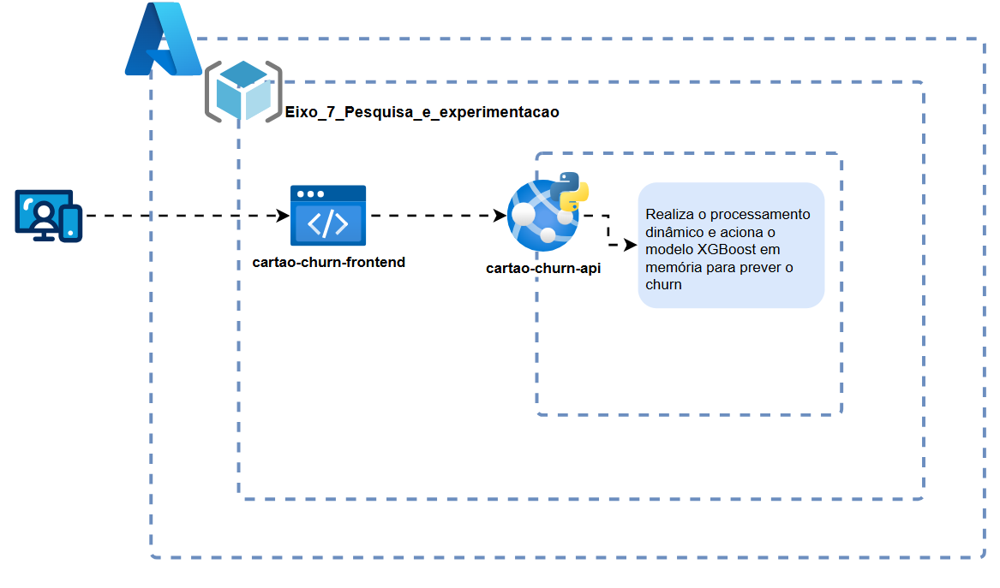

# Implantação da solução

### Avaliação e Escolha do Provedor de Nuvem

Para definir onde a nossa API de previsão de *churn* seria hospedada, analisamos as soluções dos três principais provedores de nuvem do mercado: AWS, Google Cloud e Microsoft Azure. 

Depois dessa análise, decidimos seguir com a **Microsoft Azure**. Os fatores que pesaram nessa escolha foram os seguintes:

* **Aproveitamento de Benefícios Institucionais:** O projeto precisava rodar dentro de uma restrição de orçamento para esta fase inicial. Desse modo, o ponto de partida foi aproveitar a parceria da faculdade com o provedor, que nos garantiu um crédito estudantil de $100 USD. Com isso, conseguimos homologar a solução na nuvem sem gerar custos para o time, usando os recursos de forma inteligente.
* **Performance e Evitação de Gargalos (*Cold Start*):** APIs voltadas para Machine Learning carregam bibliotecas pesadas, como o `xgboost`, `pandas` e `scikit-learn`. Se usássemos soluções puramente baseadas em funções (como AWS Lambda), cada requisição isolada demoraria segundos para responder após um tempo ocioso. Além disso, o **Azure App Service** nos permitiu rodar a aplicação em uma instância contínua. Assim, o modelo fica permanentemente carregado na memória do servidor, garantindo que o retorno da rota `/api/predict` seja imediato para o usuário final.
* **Praticidade no Deploy e Suporte ao Flask:** A arquitetura do nosso código (`application.py`) foi desenhada para subir de forma direta, gerenciando dependências pelo `requirements.txt`. A Azure entregou um ambiente pronto para aplicações Python baseado em Linux que casou perfeitamente com a nossa proposta. Em vista disso, conseguimos configurar o deploy integrado ao repositório sem precisar gastar horas configurando servidores complexos do zero, permitindo inclusive que o treinamento em *background* via *threads* funcionasse sem travamentos.

### Configuração do Ambiente e Recursos Computacionais

Para garantir que o serviço rodasse de forma estável dentro do limite gratuito do nosso plano, configuramos uma infraestrutura enxuta, mas suficiente para as necessidades da aplicação. 

Abaixo estão os detalhes do ambiente que montamos no painel da Azure:

* **Serviço de Hospedagem:** Optamos pelo **Azure App Service**, rodando sob o Plano de Serviço básico/gratuito B1/F1 em ambiente Linux.
* **Processamento (CPU):** O ambiente conta com **1 vCPU compartilhada**. Como o modelo é leve para fazer predições pontuais, essa capacidade atende perfeitamente a demanda de requisições por segundo.
* **Memória RAM:** Reservamos **1 GB de memória**. Esse espaço é mais do que suficiente para alocar o interpretador Python, carregar o pacote do XGBoost e processar o pipeline de dados em tempo real.
* **Armazenamento:** O plano oferece **1 GB de armazenamento local**. Desse modo, temos espaço de sobra para armazenar o arquivo da aplicação (`application.py`), as dependências e os arquivos CSV de dados (como o `BankChurners.csv`) que alimentam o treino.
* **Rede:** A Azure fornece uma configuração padrão com IP público dinâmico e o domínio padrão do app service. Além disso, o tráfego já conta com suporte nativo a conexões HTTPS, garantindo a segurança no envio dos dados dos clientes até a API.

### Arquitetura de Implantação da Solução

Para consolidar a visão de como todos esses componentes conversam dentro do ecossistema da nuvem, desenhamos o diagrama de arquitetura do sistema que guia o fluxo da nossa solução em produção.

A topologia adotada segue uma divisão clara de responsabilidades distribuída da seguinte forma:

* **Fronteira e Grupo de Recursos:** Delimitamos toda a nossa infraestrutura na região geográfica **Brazil South** da Microsoft Azure. Com o intuito de manter a organização corporativa, todos os ativos foram agrupados sob o mesmo container lógico, o grupo de recursos `Eixo 7 Pesquisa e experimentacao`.
* **Distribuição do Frontend:** A interface que interage com o usuário final está hospedada no **Azure Static Web Apps** (`cartao-churn-frontend`). Assim que a página é acessada, o navegador carrega os elementos estáticos. Quando o operador envia os dados do formulário, a aplicação realiza uma chamada via protocolo HTTPS (método POST) despachando uma estrutura JSON.
* **Processamento na API (`cartao-churn-api`):** O backend recebe essa chamada através do **Azure App Service**. No coração dessa caixa, acontece a **execução do algoritmo de ML** em tempo de execução: a API Flask trata os dados recebidos, lida com possíveis valores nulos aplicando dicionários padrões de mercado, faz a transformação categórica (*One-Hot Encoding*) e aciona o modelo XGBoost que permanece instanciado diretamente na memória RAM para garantir uma resposta imediata.
* **Resiliência e Recuperação:** Além disso, em caso de inicialização da aplicação ou indisponibilidade do modelo carregado em memória, o backend executa automaticamente um novo treinamento utilizando o dataset disponível localmente.

### Modelagem Matemática e Simulação da Capacidade

Para estimar como o servidor se comportaria em produção, analisamos o funcionamento da aplicação com base na arquitetura implementada no arquivo `application.py`. A partir dessa análise, identificamos dois estados principais de operação: inferência e treinamento do modelo.

#### A. Estado de Inferência Dinâmica (Tempo de Execução)

A principal função da API é responder às chamadas da rota `/api/predict`, que calcula a probabilidade de *churn* a partir dos dados informados pelo usuário.

* **Cálculo de Processamento:** A cada requisição recebida, a aplicação realiza o pré-processamento dos dados e executa a inferência utilizando o modelo XGBoost carregado em memória. De forma simplificada, o custo computacional pode ser representado por $O(N \cdot T)$, onde $N$ representa a quantidade de atributos analisados e $T$ representa o número de árvores utilizadas pelo modelo.
* **Processamento em Memória:** Como o modelo permanece carregado após o treinamento, não é necessário reconstruí-lo ou carregá-lo novamente a cada requisição, reduzindo a sobrecarga de processamento.
* **Capacidade Operacional:** Considerando que o sistema foi projetado para apoiar consultas realizadas por analistas e gestores de forma pontual, a infraestrutura escolhida apresenta capacidade compatível com o volume esperado de utilização.

#### B. Estado de Treinamento em Background

Além das operações de predição, a aplicação também é capaz de realizar o treinamento do modelo utilizando a base de dados disponível.

* **Pico de Consumo:** O treinamento representa o momento de maior utilização dos recursos computacionais, pois envolve leitura dos dados, transformação das variáveis, validação cruzada e treinamento de múltiplas configurações do modelo.
* **Mitigação de Gargalos:** Para evitar indisponibilidade da aplicação durante esse processo, o treinamento é executado em uma *thread* separada utilizando a biblioteca `threading.Thread`. Dessa forma, o processo principal do Flask permanece disponível para responder às rotas de monitoramento e verificação de status enquanto o treinamento ocorre em segundo plano.

### Monitoramento e Alertas

Para acompanhar o comportamento do sistema sem precisar instalar ferramentas externas ou gerar custos adicionais, decidimos utilizar os recursos de telemetria que a própria plataforma Azure oferece nativamente para o App Service.

A estratégia adotada para gerenciar a saúde do app foi estruturada da seguinte forma:

* **Acompanhamento por Métricas Nativas:** Utilizamos os gráficos padrão de monitoramento da nuvem para observar indicadores essenciais. Entre eles estão o **Consumo de CPU (%)**, a **Utilização de Memória (MB)** e o **Volume de Erros HTTP (códigos 5xx)**. Desse modo, conseguimos validar se as requisições de previsão não estão sobrecarregando a nossa instância.
* **Estratégia de Controle e Prevenção:** Como estamos operando dentro do teto do plano estudantil, a automação de escala (auto-scaling) foi mantida desativada por escolha de design. Com isso, evitamos que o ambiente criasse novas instâncias pagas automaticamente em picos de acesso. 

# Apresentação da solução
O vídeo de apresentação está disponível no YouTube: [Video Apresentação](https://youtu.be/SEU_LINK_AQUI).

O arquivo do vídeo também está incluído na pasta: `docs/video/video_apresentacao.mp4`.
